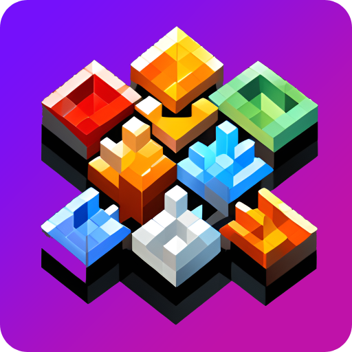

<div align='center'>

</div>

# micro{tess} [](https://github.com/micro-gl/micro-tess/actions/workflows/compile.yml)

**Fast**, **Slim**, **Embeddable**, **Allocator-aware**, **Headers files** only **`C++11`** geometry tesselation  
library for vector graphics, that can run on any 32/64 bits computer with or without **FPU**.  
**No standard library required**.

check out our website at [micro-gl.github.io/docs/micro-tess/](https://micro-gl.github.io/docs/micro-tess)

## Features

> **Language** &nbsp;&nbsp;&nbsp;&nbsp;&nbsp;&nbsp;
- **`C++11`**, does not use any **`STL`** library and **standard library**.
- **Headers only** library
- Most functions are templates, which means you compile only what is used
- Compile-time polymorphism (no runtime virtual methods)
- Support for 32 bits and 64 bits
- Self contained and modular.

> **Geometry** &nbsp;&nbsp;&nbsp;&nbsp;&nbsp;&nbsp;

- Tesselation in any precision, fixed point precision, float or double.
- **BiQuadratic**/**BiCubic** **Bezier Patch** triangle Tessellation
- **Quadratic**/**Cubic** **Bezier** curve divider
- **Elliptic Arc Divider**
- **Ear Clipping** Tessellation for Simple (convex or concave) polygons
- **X/Y Montone** Tessellation for Monotone polygons
- **Fan Triangulation** for Convex polygons
- **Stroke Tessellation** with **dashes** (also supported with Path object)
- **Fill Tessellation** for any type of multi polygons using **even-odd** and **non-zero** rule
- **Path** object to easily define **vector graphics** and **tessellate** them using **fill** or **stroke**

> **Extra** &nbsp;&nbsp;&nbsp;&nbsp;&nbsp;&nbsp;
- Packed with fixed precision numbers `Q` class
- Computes boundary information for quick AA.
- Packed with triangles iterator for regular, fan and strip batch triangles
- Packed with many working examples


## Installing `micro{tess}`
`micro-tess` is a headers only library, which gives the following install possibilities:
1. Using `cmake` to invoke the `install` target, that will copy everything in your system via
```bash
$ mkdir cmake-build-release
$ cd cmake-build-release
$ cmake -DCMAKE_BUILD_TYPE=Release ..
$ cmake --install .
```
2. Copying the `include/micro-tess` to anywhere you want.

## Consuming `micro{tess}`
Following options are available:
1. copy the project to a sub folder of your project. inside your **`CMakeLists.txt`** add
```cmake
add_subdirectory(/path/to/micro-tess)
target_link_libraries(your_app micro-tess)
```
2. If you installed **`micro{tess}`** with option 1 (see above) at your system, you can instead
```cmake
find_package(micro-tess CONFIG REQUIRED)
target_link_libraries(your_app micro-tess::micro-tess)
```
3. If you have not installed, you can add in your app's `CMakeLists.txt`
```cmake
target_include_directories(app path/to/micro-tess/folder/include/)
```
4. If you manually copied the `include/micro-tess` to the default system include path,  
   you can use `cmake/Findmicro-tess.cmake` to automatically create the cmake targets
```cmake
list(APPEND CMAKE_MODULE_PATH ${PROJECT_SOURCE_DIR}/path/to/Findmicro-tess/folder)
find_package(micro-tess REQUIRED)
target_link_libraries(your_app micro-tess::micro-tess)
```
5. Just copy the `include/micro-tess` into a sub folder of your project and include the header  
   files you need with relative path in your source files.

## Running Examples
First make sure you have
- [SDL2](https://www.libsdl.org/) installed at your system.
- [microgl](https://github.com/micro-gl/micro-gl) installed at your system.
- [cmake](https://cmake.org/download/) installed at your system.

There are two ways:
1. Use your favourite IDE to load the root `CMakeLists.txt` file, and then it   
   will pick up all of the targets, including the examples
2. Using the command line:
```bash
$ mkdir cmake-build-release
$ cd cmake-build-release
$ cmake -DCMAKE_BUILD_TYPE=Release ..
$ cmake --build . --target <example_name>
$ ../examples/bin/example_name
```

```text
Author: Tomer Shalev, tomer.shalev@gmail.com, all rights reserved (2021)
```
